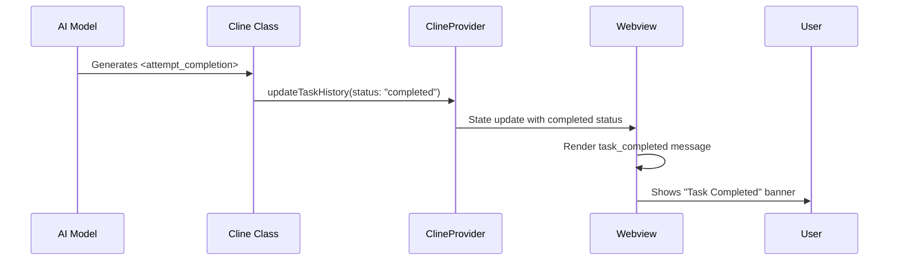

# Learning Cline 

Creates unique taskId for each conversation

Initializes API handlers for AI providers

Manages terminal interactions through TerminalManager

Handles web content with UrlContentFetcher

Controls browser automation via BrowserSession


Core execution : 

```javascript
private async initiateTaskLoop(userContent: UserContent): Promise<void> {
  while (!this.abort) {
    const didEndLoop = await this.recursivelyMakeClineRequests(nextUserContent)
    if (didEndLoop) break
    // ... loop continues
  }
}

private async recursivelyMakeClineRequests(userContent: UserContent): Promise<boolean> {
  // 1. Process user content
  // 2. Call AI API
  // 3. Handle tool executions
  // 4. Update conversation history
}
```


### Execution Flow:

1. User initiates task

2. System gathers environment context

3. Sends request to AI model

4. Parses model response for tools/text

5. Executes approved tools

6. Updates conversation state

7. Repeats until completion

### Task completed logic: 


```javascript
case "attempt_completion": {
  await this.say("completion_result", result, undefined, false);
  const { response } = await this.ask("completion_result", "", false);
  if (response === "yesButtonClicked") {
    pushToolResult(""); // Signals completion
    return true; // This breaks the recursive loop
  }
}
```


#### Final Completion Handling (in recursivelyMakeClineRequests):
```javascript
if (didEndLoop) {
  // This triggers actual completion
  await this.providerRef.deref()?.updateTaskHistory({
    id: this.taskId,
    status: "completed" // <-- Final status change
  });
  await this.say("task_completed", "Task completed");
  return true;
}
```


High overview of task completion : 





